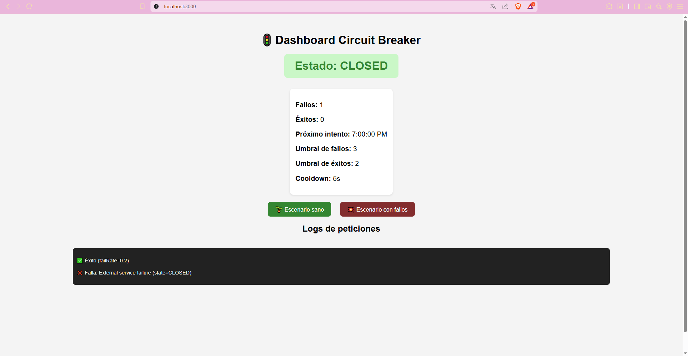

# 🚦 Circuit Breaker Dashboard  

Este proyecto es una simulación visual de un **Circuit Breaker** para microservicios.  
Permite observar cómo cambia el estado del *circuit breaker* (`Closed`, `Open`, `Half-Open`) cuando se realizan peticiones al servicio y este responde correctamente o falla.  

---

## 📖 Descripción de la prueba  

La prueba consiste en implementar el patrón **Circuit Breaker** y representarlo visualmente en un dashboard.  
El circuito protege al sistema de sobrecargas y fallas consecutivas en un servicio externo.  

Se muestran en tiempo real:  
- El **estado actual del circuito**.  
- El resultado de cada petición (éxito o fallo).  
- Un registro de logs para entender el comportamiento del sistema.  

---

## 🎯 Objetivo(s) de la prueba  

- Implementar un **Circuit Breaker** en un entorno controlado.  
- Observar cómo responde el patrón frente a escenarios de fallas y recuperación.  
- Brindar una visualización clara para comprender mejor los estados del circuito.  

---

## ⚙️ Pasos implementados  

1. Configuración inicial del proyecto con **Node.js**.  
2. Implementación de un servicio simulado que responde con éxito o error según un *failure rate*.  
3. Desarrollo de un **circuit breaker** con los tres estados principales:  
   - 🟢 Closed  
   - 🔴 Open  
   - 🟡 Half-Open  
4. Creación de un **dashboard visual** en el navegador que:  
   - Muestra el estado del circuito.  
   - Genera logs en tiempo real.  
   - Incluye botones de control para cambiar la tasa de fallos (20% o 70%).  
5. Documentación y pruebas de comportamiento.  

---

## 🛠️ Tecnologías usadas  

- **Node.js** (entorno de ejecución).  
- **HTML5** (estructura del dashboard).  
- **CSS3** (estilos y estados visuales).  
- **JavaScript (Vanilla)** (lógica del circuito y simulación).  

---

## 🚀 Uso  

1. Clona este repositorio

```console
git clone https://github.com/kathe-dev/circuit-breaker-dashboard.git
cd circuit-breaker-dashboard
```

2. Instala las dependencias
```console
npm install
```

3. Inicia el proyecto en modo desarrollo:
```console
npm run dev
```

4. Abre el navegador en la URL que indique la terminal (http://localhost:3000).
5. Verás el panel principal con el **estado del circuito** y los botones de control.  
6. Selecciona un escenario con los botones:  
   - 🌱 Escenario sano → 20% de fallos.  
   - 💥 Escenario con fallos → 70% de fallos.  
7. Observa cómo cambian el **estado** y los **logs** en tiempo real.  

## 🛠️ Tecnologías  

- **HTML5**  
- **CSS3**  
- **JavaScript** (sin librerías externas)  

## 📷 Vista previa  

  
